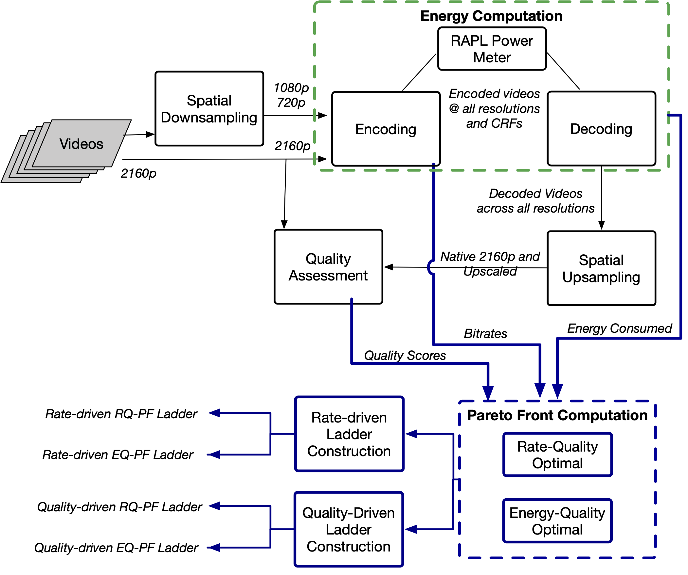

# 
This repository contains data and code from the following paper:
A. Katsenou, X. Wang, D. Schien, and D. Bull, ["Rate-Quality or Energy-Quality Pareto Fronts for Adaptive Video Streaming?"](https://arxiv.org/abs/2402.07057), submitted to ICIP 2024. 

Adaptive video streaming is a key enabler for optimising the delivery of offline encoded video content. The research focus to date has been on optimisation, based solely on rate-quality curves. This paper adds an additional dimension, the energy expenditure, and explores construction of bitrate ladders based on decoding energy-quality curves rather than the conventional rate-quality curves. Pareto fronts are extracted from the rate-quality and energy-quality spaces to select optimal points. Bitrate ladders are constructed from these points using conventional rate-based rules together with a novel quality-based approach. Evaluation on a subset of YouTube-UGC videos encoded with x.265 shows that the energy-quality ladders reduce energy requirements by 28-31% on average at the cost of slightly higher bitrates. The results indicate that optimising based on energy-quality curves rather than rate-quality curves and using quality levels to create the rungs could potentially improve energy efficiency for a comparable quality of experience.

## Methodology

The figure shows the proposed methodology.
   
## Data:
All measurements and computations of quality and rate across the different compression levels are reported in the [Data](./data/) directory.

Energy was measured with a software power meter based on RAPL. The methodology developed around this is explained in [PCS 2024](../PCS-2024/) work.

### Video Test Sequences
The video sequences used in this work have been sampled from the YouTube-UGC dataset [[Yilin Wang, 2019][1]]:
[UGC Dataset Google Cloud Storage](https://console.cloud.google.com/storage/browser/ugc-dataset/original_videos;tab=objects?prefix=&forceOnObjectsSortingFiltering=false). The full list of the sequences along with their metadata are provided in the [Metadata](./metadata/) directory.

[1]: https://arxiv.org/abs/1904.06457

