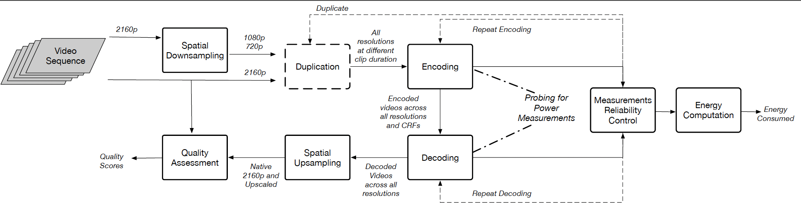

# Measuring Energy, Quality, and Rate in Video Compression
This repository contains data and code from the following paper:
A. Katsenou, X. Wang, D. Schien, and D. Bull, ["Comparative Study of Hardware and Software Power Measurements in Video Compression"](https://arxiv.org/abs/2312.12150), accepted in PCS 2024. 

The paper presents a comprehensive study of power measurement techniques in video compression, comparing the use of hardware and software power meters. An experimental methodology to ensure reliability of measurements is introduced. Key findings demonstrate the high correlation of hardware and software based energy measurements for two video codecs across different spatial and temporal resolutions at a lower computational overhead.


## Experiment Pipeline



The figure shows the basic experimental pipeline.


### Preprocessing
- [x] Convert MKV to YUV
- [x] Read Bitrate for Raw Video
- [x] Downsample 4K to 1080p and 720p
- [x] Hardware Power Measurement: 
  - 2 duplicate times for 4K videos (this can be adapted, 2 is the usual number)
  - 12 duplicate times for 1080p and 720p videos (this can be adapted, 12 is the usual number)
- [x] Software Power Measurement: 
  - No duplications required for 4K and 1080p videos due to the high sampling rate
  - 2 duplicate times for 720p videos (this can be adapted, 2 is the usual number)
- [x] Read Bitrate for Raw Duplicate Video

### Encoding  
- [x] Encode at different QP levels: [10, 20, 30, 40, 50]
- [x] Hardware Power Measurement: Repeat X times (these reps have been tested for conformance with a t-test, 10 is the usual number)
- [x] Software Power Experiment: No repeat time (because of the high sampling rate)
- [x] Read Bitrate for Encoded Video
- [x] Calculate Encoding Energy Consumption

### Decoding

- [x] Hardware Power Measurement: Repeat X times (these reps have been tested for conformance with a t-test, 10 is the usual number)
- [x] Software Power Experiment: Different repetitions based on resolution
- [x] Calculate Decoding Energy Consumption

*Note: During decoding no data are stored locally.*

### Measuring Quality
- [x] Upsample Decoded Downsampled Videos to 4K (native spatial resolution)
- [x] Calculate PSNR
- [x] Calculate VMAF

### Energy Consumption
- [x] Measure Time and Get Power Log
- [x] Calculate Energy for Each Coding Job (Encoding/Decoding)

*Note: In the case of hardware power measurements, the alignment of the timestamps of the encoding/decoding process with the power logging is important.*


## Main Workflow

- **run_codec_metrics.py**: Main workflow

## 4K Video Processing

### Hardware Power Measurement

- **run_codec_metrics_downsample_4k_repeat_duplicate.py**: Downsample and duplicate (repeat time with t-distribution)
- **run_codec_metrics_nodownsample_4k_repeat_duplicate.py**: No downsample and duplicate (repeat time with t-distribution)

### Software Power Measurement

- **run_codec_metrics_downsample_4k_duplicate_rapl.py**: Downsample and duplicate
- **run_codec_metrics_nodownsample_4k_duplicate_rapl.py**: No downsample and duplicate

# Deployment
- Download some original videos from YouTube

  1. Find files with `gsutil ls gs://ugc-dataset/original_videos/`
  2. Download desired files. For example:
     ```
     gsutil -m cp -r gs://ugc-dataset/original_videos/TelevisionClip/1080P/TelevisionClip_1080P-68c6.mkv .
     ```
     **Make sure to recreate folder structure /<resolution>**
  3. Keep the 'src/logs' folder

  
- Deploying rapl-tools on Ubuntu

  1. **Introduction:**
     - Tools for monitoring CPU power with Intel's RAPL interface.
     - Original GitHub Repository: [kentcz/rapl-tools](https://github.com/kentcz/rapl-tools/).

  2. **Building the Tool:**
     - The tool is built with Gnu Make. G++ version 4.7 or higher is required:
       ```bash
       make
       ```

  3. **Setup on Ubuntu:**
     - Install and load the msr module:
       ```bash
       sudo apt-get install msr-tools
       sudo modprobe msr
       ```

     - Set permissions:
       ```bash
       sudo chmod o+rw /dev/cpu/0/msr
       ```

# Requirement
```
# Create and activate a Conda environment
conda create -n videoenc pip python=3.10
conda activate videoenc

# Install dependencies
pip install -r requirements.txt

# Deactivate the Conda environment
conda deactivate
```

   
# 4K Test Sequences:
You can find the test dataset from YT-UGC Dataset [[Yilin Wang, 2019][1]]:
[UGC Dataset Google Cloud Storage](https://console.cloud.google.com/storage/browser/ugc-dataset/original_videos;tab=objects?prefix=&forceOnObjectsSortingFiltering=false)

- Gaming_2160P-2dc4.mkv
- HDR_2160P-06ae.mkv
- Sports_2160P-0455.mkv
- Vlog_2160P-030a.mkv
- Animation_2160P-41dc,mkv
- Gaming_2160P-2cb1.mkv
- Gaming_2160P-3002.mkv 
- Gaming_2160P-348d.mkv
- Gaming_2160P-34a1.mkv 
- Sports_2160P-086d.mkv 
- Sports_2160P-1261.mkv 
- Sports_2160P-1733.mkv 
- Sports_2160P-1b70.mkv

[1]: https://arxiv.org/abs/1904.06457


