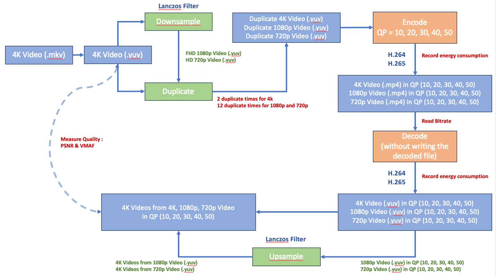

# quality-energy

## Overall Experiment Architecture




## Preprocessing
- [x] Convert MKV to YUV
- [x] Read Bitrate for Raw Video
- [x] Downsample 4K to 1080p and 720p
- [x] Hardware Power Measurement: 
  - 2 duplicate times for 4K videos
  - 12 duplicate times for 1080p and 720p videos
- [x] Software Power Measurement: 
  - No duplicate time for 4K and 1080p videos
  - 2 duplicate times for 720p videos
- [x] Read Bitrate for Raw Duplicate Video

## Encoding  
- [x] Encode with Different QP Levels: [10, 20, 30, 40, 50]
- [x] Hardware Power Measurement: Repeat 10 times
- [x] Software Power Experiment: No repeat time
- [x] Read Bitrate for Encoded Video
- [x] Calculate Encoding Energy Consumption

## Decoding
- [x] Hardware Power Measurement: Repeat 10 times
- [x] Software Power Experiment: No repeat time
- [x] Without Writing the Decoded File
- [x] Calculate Decoding Energy Consumption

## Measure Quality
- [x] Upsample Decoded Downsampled Videos to 4K 
- [x] Calculate PSNR
- [x] Calculate VMAF

## Energy Consumption
- [x] Measure Time and Get Power Log
- [x] Calculate Energy for Each Coding Job (Encoding/Decoding)


# Main Workflow

- **run_codec_metrics.py**: Main workflow
- **run_codec_metrics_downsample.py**: Main workflow with downsample process and hardware power measurement

## 4K Video Processing

### Hardware Power Measurement

- **run_codec_metrics_downsample_4k_noduplicate.py**: Downsample and no duplicate
- **run_codec_metrics_downsample_4k_repeat_duplicate.py**: Downsample and duplicate (repeat time with t-distribution)
- **run_codec_metrics_nodownsample_4k_noduplicate.py**: No downsample and no duplicate
- **run_codec_metrics_nodownsample_4k_repeat_duplicate.py**: No downsample and duplicate (repeat time with t-distribution)

### Software Power Measurement

- **run_codec_metrics_downsample_4k_duplicate_rapl.py**: Downsample and duplicate
- **run_codec_metrics_nodownsample_4k_duplicate_rapl.py**: No downsample and duplicate


## Energy and Power Analysis

- **energy_analysis.ipynb**: Energy analysis
- **run_plot_energy_perCod.ipynb**: Energy analysis
- **run_plot_power.ipynb**: 
  - Power vs. timestamp for each video sequence at different QP levels
- **run_plot_power_duplicate.ipynb**: 
  - Power vs. timestamp for each video sequence at different QP levels
  - For duplicate video
- **run_plot_quality.ipynb**:
  - VMAF/PSNR vs. Bitrate for each genre
  - Average based on different QP levels, all codecs in one figure


## Data Analysis

- **combine_csv.py**
- **run_energy_log.py**: Calculate energy for each codec without repeat
- **run_energy_log_repeat.py**: Calculate energy for each codec with repeat encoding and decoding processes

### Energy vs. Quality Analysis

- **run_plot_energy_avgQP.py**: 
  - VMAF/PSNR vs. Energy for each genre
  - Average based on different QP levels, all codecs in one figure (`/fig/` folder)
- **run_plot_energy_perSeq_perCod.py**: 
  - VMAF/PSNR vs. Energy for each codec 
  - VMAF/PSNR/Bitrate vs. Energy, all video sequences in one figure or per video sequence (`/fig/codec/energy/` and `/fig/codec/energy/per/` folder)

### Quality vs. Bitrate Analysis

- **run_plot_quality_avgQP.py**: 
  - VMAF/PSNR vs. Bitrate for each genre
  - Average based on different QP levels, all codecs in one figure (`/fig/` folder)
- **run_plot_quality_avgQP_perCod.py**: 
  - VMAF/PSNR vs. Bitrate for each codec
  - Average based on different QP levels, per video sequence (`/fig/codec/average_QP/` folder)
- **run_plot_quality_perSeq_perCod.py**: 
  - VMAF/PSNR vs. Bitrate for each codec
  - All video sequences in one figure or per video sequence (`/fig/codec/` folder)

### Test Scripts
- **power_log_extract.py**: extract the power log for a specific date
- **power_log_filter.ipynb**: extract the nearest power from power log and calculate the energy


# Deployment
- Download some original videos from YouTube

  1. Find files with `gsutil ls gs://ugc-dataset/original_videos/`
  2. Download desired files. For example:
     ```
     gsutil -m cp -r gs://ugc-dataset/original_videos/TelevisionClip/1080P/TelevisionClip_1080P-68c6.mkv .
     ```
     **Make sure to recreate folder structure /<resolution>**
  3. Keep the 'src/logs' folder

   
# 4K Test Sequences:
- Gaming_2160P-2dc4.mkv: 13.9 GB
- HDR_2160P-06ae.mkv: 11.1 GB
- Sports_2160P-0455.mkv: 7.0 GB
- Vlog_2160P-030a.mkv: 5.6 GB


